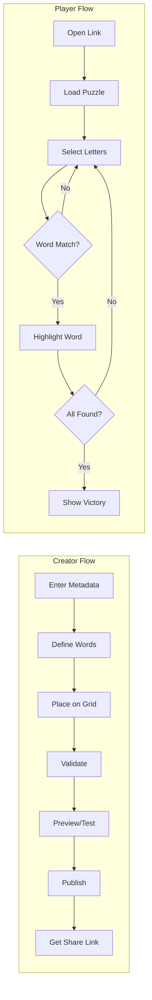
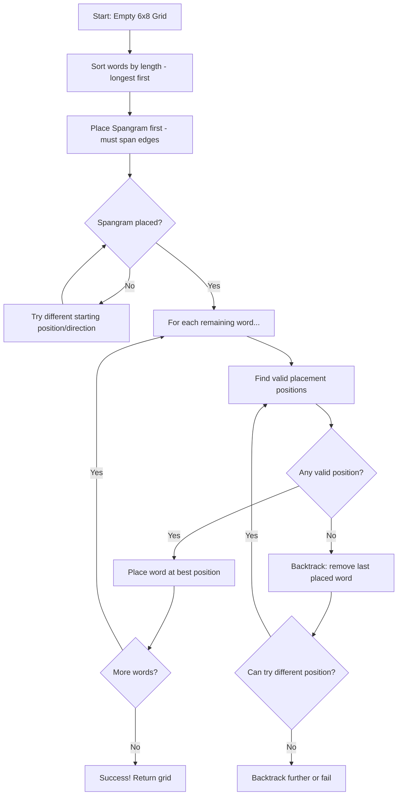

# Strands+ Architecture Plan

> A DIY Strands Puzzle Creator — Create and share custom word puzzles inspired by NYT Strands

---

## Table of Contents

1. [Overview](#1-overview)
2. [Data Model](#2-data-model)
3. [API Design](#3-api-design)
4. [Page Structure](#4-page-structure)
5. [Component Architecture](#5-component-architecture)
6. [Grid Logic](#6-grid-logic)
7. [Creator Validation Rules](#7-creator-validation-rules)
8. [Slug Generation](#8-slug-generation)
9. [State Management](#9-state-management)
10. [File/Folder Structure](#10-filefolder-structure)
11. [Auto-Arrange Algorithm](#11-auto-arrange-algorithm)
12. [Future Considerations](#12-future-considerations)

---

## 1. Overview

### Tech Stack

| Layer     | Technology                       |
| --------- | -------------------------------- |
| Framework | Next.js 16.1+ (App Router)       |
| Hosting   | Vercel                           |
| Database  | PostgreSQL via Neon (serverless) |
| ORM       | Drizzle ORM                      |
| Styling   | Tailwind CSS                     |
| State     | React state + localStorage       |
| Auth      | None (anonymous)                 |

### Core User Flows



### UX Design Principles

| Principle             | Implementation                                                                                                   |
| --------------------- | ---------------------------------------------------------------------------------------------------------------- |
| **Slug is invisible** | The 6-character slug only appears in the URL. Users never see raw slugs — only "Share" buttons and copy actions. |
| **Minimal friction**  | Fewest possible steps to publish. No account required.                                                           |
| **Mobile-first**      | Touch-friendly tap targets (44px+), responsive grid, no hover-only interactions.                                 |
| **Dark mode default** | Easier on eyes, modern aesthetic.                                                                                |
| **Instant feedback**  | Visual confirmation on every action (word found, validation pass/fail).                                          |

> **Important**: The slug (e.g., `V4QIYY`) is **only for URLs**. The UI should show:
>
> - "Share Puzzle" button (not "Copy slug")
> - "Copy Link" action (copies full URL)
> - Puzzle title and author (not the slug)
>
> The slug is meaningless to users — it's an internal identifier that enables sharing.

---

## 2. Data Model

### Database Schema

```sql
CREATE TABLE puzzles (
    id              SERIAL PRIMARY KEY,
    slug            VARCHAR(6) UNIQUE NOT NULL,
    title           VARCHAR(100) NOT NULL,
    author          VARCHAR(50) NOT NULL,
    theme_clue      VARCHAR(200) NOT NULL,

    -- Grid stored as a flat 48-character string (row-major order)
    -- Position = row * 6 + col (0-indexed)
    grid_letters    CHAR(48) NOT NULL,

    -- Spangram data
    spangram_word   VARCHAR(20) NOT NULL,
    spangram_path   JSONB NOT NULL,  -- Array of [row, col] coordinates

    -- Theme words data
    theme_words     JSONB NOT NULL,  -- Array of { word: string, path: [row, col][] }

    created_at      TIMESTAMP DEFAULT CURRENT_TIMESTAMP,

    -- Indexes
    CONSTRAINT valid_grid_length CHECK (LENGTH(grid_letters) = 48)
);

CREATE INDEX idx_puzzles_slug ON puzzles(slug);
CREATE INDEX idx_puzzles_created_at ON puzzles(created_at DESC);
```

### TypeScript Types

```typescript
// types/puzzle.ts

export interface Coordinate {
  row: number; // 0-7
  col: number; // 0-5
}

export interface ThemeWord {
  word: string;
  path: Coordinate[];
}

export interface Puzzle {
  id: number;
  slug: string;
  title: string;
  author: string;
  themeClue: string;
  gridLetters: string; // 48 chars, row-major
  spangramWord: string;
  spangramPath: Coordinate[];
  themeWords: ThemeWord[];
  createdAt: Date;
}

// For API responses (without internal id)
export interface PuzzlePublic {
  slug: string;
  title: string;
  author: string;
  themeClue: string;
  gridLetters: string;
  spangramWord: string;
  spangramPath: Coordinate[];
  themeWords: ThemeWord[];
}

// For puzzle creation
export interface CreatePuzzleInput {
  title: string;
  author: string;
  themeClue: string;
  gridLetters: string;
  spangramWord: string;
  spangramPath: Coordinate[];
  themeWords: ThemeWord[];
}
```

### Grid Coordinate System

```
        Col 0  Col 1  Col 2  Col 3  Col 4  Col 5
       ┌──────┬──────┬──────┬──────┬──────┬──────┐
Row 0  │  0   │  1   │  2   │  3   │  4   │  5   │
       ├──────┼──────┼──────┼──────┼──────┼──────┤
Row 1  │  6   │  7   │  8   │  9   │ 10   │ 11   │
       ├──────┼──────┼──────┼──────┼──────┼──────┤
Row 2  │ 12   │ 13   │ 14   │ 15   │ 16   │ 17   │
       ├──────┼──────┼──────┼──────┼──────┼──────┤
Row 3  │ 18   │ 19   │ 20   │ 21   │ 22   │ 23   │
       ├──────┼──────┼──────┼──────┼──────┼──────┤
Row 4  │ 24   │ 25   │ 26   │ 27   │ 28   │ 29   │
       ├──────┼──────┼──────┼──────┼──────┼──────┤
Row 5  │ 30   │ 31   │ 32   │ 33   │ 34   │ 35   │
       ├──────┼──────┼──────┼──────┼──────┼──────┤
Row 6  │ 36   │ 37   │ 38   │ 39   │ 40   │ 41   │
       ├──────┼──────┼──────┼──────┼──────┼──────┤
Row 7  │ 42   │ 43   │ 44   │ 45   │ 46   │ 47   │
       └──────┴──────┴──────┴──────┴──────┴──────┘

Index = row * 6 + col
Row = Math.floor(index / 6)
Col = index % 6
```

---

## 3. API Design

### Endpoints

| Method | Endpoint              | Purpose              |
| ------ | --------------------- | -------------------- |
| POST   | `/api/puzzles`        | Create a new puzzle  |
| GET    | `/api/puzzles/[slug]` | Fetch puzzle by slug |

### POST `/api/puzzles`

Creates a new puzzle and returns the generated slug.

**Request Body:**

```typescript
interface CreatePuzzleRequest {
  title: string;
  author: string;
  themeClue: string;
  gridLetters: string;
  spangramWord: string;
  spangramPath: Coordinate[];
  themeWords: ThemeWord[];
}
```

**Response (201 Created):**

```typescript
interface CreatePuzzleResponse {
  success: true;
  slug: string;
  url: string; // Full shareable URL
}
```

**Error Response (400 Bad Request):**

```typescript
interface ErrorResponse {
  success: false;
  error: string;
  details?: string[]; // Specific validation failures
}
```

**Server-Side Validation:**

1. `title` — Required, 1-100 characters
2. `author` — Required, 1-50 characters
3. `themeClue` — Required, 1-200 characters
4. `gridLetters` — Exactly 48 uppercase letters A-Z
5. `spangramWord` — At least 4 characters
6. `spangramPath` — Valid coordinates, adjacent cells, spans opposite edges
7. `themeWords` — At least 1 word, each at least 4 characters
8. All paths use every cell exactly once (no overlaps, no gaps)

### GET `/api/puzzles/[slug]`

Fetches a puzzle by its 6-character slug.

**Response (200 OK):**

```typescript
interface GetPuzzleResponse {
  success: true;
  puzzle: PuzzlePublic;
}
```

**Error Response (404 Not Found):**

```typescript
interface ErrorResponse {
  success: false;
  error: "Puzzle not found";
}
```

---

## 4. Page Structure

### Route Definitions

| Route          | Page         | Purpose                               |
| -------------- | ------------ | ------------------------------------- |
| `/`            | Home         | Landing page with Create/Play options |
| `/create`      | Creator      | Puzzle creation wizard                |
| `/play/[slug]` | Player       | Play a specific puzzle                |
| `/how-to-play` | Instructions | Game rules explanation                |

### Page Details

#### `/` — Home Page

```
┌─────────────────────────────────────────┐
│              STRANDS+                   │
│     Create your own word puzzles        │
│                                         │
│  ┌───────────────┐  ┌───────────────┐   │
│  │   CREATE A    │  │    PLAY A     │   │
│  │    PUZZLE     │  │    PUZZLE     │   │
│  │      ➕       │  │      ▶        │   │
│  └───────────────┘  └───────────────┘   │
│                                         │
│         [How to Play]                   │
│                                         │
└─────────────────────────────────────────┘
```

**Components:** `Hero`, `ActionCards`

#### `/create` — Creator Page

Multi-step wizard:

1. **Step 1: Metadata** — Title, author, theme clue
2. **Step 2: Words** — Enter spangram and theme words
3. **Step 3: Grid** — Place words on grid (manual or auto)
4. **Step 4: Validate** — Run all validation checks
5. **Step 5: Preview** — Play-test the puzzle
6. **Step 6: Publish** — Get shareable link

**Step 3 (Grid Placement):**

```
┌─────────────────────────────────────────┐
│  ← Back                    Step 3 of 6  │
├─────────────────────────────────────────┤
│                                         │
│         PLACE YOUR WORDS                │
│                                         │
│   ┌───┬───┬───┬───┬───┬───┐            │
│   │ B │ E │ A │ C │ H │ T │            │
│   ├───┼───┼───┼───┼───┼───┤            │
│   │ O │ W │ E │ L │ S │ A │            │
│   ├───┼───┼───┼───┼───┼───┤            │
│   │ ...                   │            │
│   └───┴───┴───┴───┴───┴───┘            │
│                                         │
│   Words to place:                       │
│   [x] BEACHGOING (spangram)             │
│   [ ] TOWEL                             │
│   [ ] SUNSCREEN                         │
│                                         │
│   [Auto-Arrange]  [Clear Grid]          │
│                                         │
│              [Continue →]               │
└─────────────────────────────────────────┘
```

**Step 6 (Publish — No slug shown):**

```
┌─────────────────────────────────────────┐
│  ← Back                    Step 6 of 6  │
├─────────────────────────────────────────┤
│                                         │
│         🎉 PUZZLE PUBLISHED!            │
│                                         │
│   "Beach Day" by Alex                   │
│                                         │
│   ┌─────────────────────────────┐       │
│   │     📋 Copy Link            │       │
│   └─────────────────────────────┘       │
│                                         │
│   ┌─────────────────────────────┐       │
│   │     📱 Share                │       │
│   └─────────────────────────────┘       │
│                                         │
│   ┌─────────────────────────────┐       │
│   │     ▶ Play Your Puzzle      │       │
│   └─────────────────────────────┘       │
│                                         │
│         [Create Another Puzzle]         │
│                                         │
└─────────────────────────────────────────┘
```

> Note: The URL is copied to clipboard directly. No slug is displayed on screen.

#### `/play/[slug]` — Player Page

```
┌─────────────────────────────────────────┐
│  STRANDS+              Beach Day        │
├─────────────────────────────────────────┤
│                                         │
│   Theme: Hitting the sandy shores       │
│                                         │
│   ┌───┬───┬───┬───┬───┬───┐            │
│   │ B │ E │ A │ C │ H │ T │            │
│   ├───┼───┼───┼───┼───┼───┤            │
│   │ O │ W │ E │ L │ S │ A │            │
│   ├───┼───┼───┼───┼───┼───┤            │
│   │░░░│░░░│░░░│░░░│░░░│░░░│  ← Found   │
│   └───┴───┴───┴───┴───┴───┘            │
│                                         │
│   Found words:                          │
│   🟡 BEACHGOING                         │
│   🔵 TOWEL                              │
│   🔵 SUNSCREEN                          │
│   __ __ __ __ (2 remaining)             │
│                                         │
└─────────────────────────────────────────┘
```

#### `/how-to-play` — Instructions Page

Static content explaining:

- Game rules
- How to select letters
- What spangram means
- Win conditions

---

## 5. Component Architecture

### Component Tree

```
app/
├── layout.tsx (RootLayout)
│   └── Header
│       ├── Logo
│       └── NavLinks
│
├── page.tsx (Home)
│   ├── Hero
│   └── ActionCards
│
├── create/page.tsx (Creator)
│   └── CreatorWizard
│       ├── WizardProgress
│       ├── MetadataStep
│       │   └── FormFields (title, author, themeClue)
│       ├── WordsStep
│       │   ├── SpangramInput
│       │   └── ThemeWordsList
│       ├── GridStep
│       │   ├── CreatorGrid
│       │   │   └── GridCell (×48)
│       │   ├── WordPlacementPanel
│       │   └── AutoArrangeButton
│       ├── ValidateStep
│       │   └── ValidationChecklist
│       ├── PreviewStep
│       │   └── GameGrid (play mode)
│       └── PublishStep
│           └── ShareLinkDisplay
│
├── play/[slug]/page.tsx (Player)
│   ├── GameHeader
│   │   ├── PuzzleTitle
│   │   └── ThemeClue
│   ├── GameGrid
│   │   └── LetterCell (×48)
│   ├── SelectionPath (visual overlay)
│   ├── FoundWordsList
│   └── CompletionModal
│
└── how-to-play/page.tsx
    └── InstructionsContent
```

### Key Component Interfaces

```typescript
// components/creator/CreatorGrid.tsx
interface CreatorGridProps {
  letters: string; // 48 chars or less (partial during creation)
  placedWords: PlacedWord[];
  selectedWord: string | null;
  onCellClick: (row: number, col: number) => void;
  onLetterPlace: (row: number, col: number, letter: string) => void;
}

interface PlacedWord {
  word: string;
  path: Coordinate[];
  isSpangram: boolean;
}

// components/player/GameGrid.tsx
interface GameGridProps {
  letters: string;
  foundWords: FoundWord[];
  currentSelection: Coordinate[];
  onCellPointerDown: (row: number, col: number) => void;
  onCellPointerEnter: (row: number, col: number) => void;
  onPointerUp: () => void;
}

interface FoundWord {
  word: string;
  path: Coordinate[];
  type: "theme" | "spangram";
}

// components/player/LetterCell.tsx
interface LetterCellProps {
  letter: string;
  row: number;
  col: number;
  state: "default" | "selected" | "found-theme" | "found-spangram";
  isSelecting: boolean;
  onPointerDown: () => void;
  onPointerEnter: () => void;
}

// components/shared/Header.tsx
interface HeaderProps {
  title?: string;
  showBackButton?: boolean;
  onBack?: () => void;
}
```

---

## 6. Grid Logic

### Letter Selection (Player)

The player selects letters by clicking/dragging to form a path:

```typescript
// lib/grid-utils.ts

export function areAdjacent(a: Coordinate, b: Coordinate): boolean {
  const rowDiff = Math.abs(a.row - b.row);
  const colDiff = Math.abs(a.col - b.col);
  // Adjacent means at most 1 step in any direction (including diagonals)
  return rowDiff <= 1 && colDiff <= 1 && !(rowDiff === 0 && colDiff === 0);
}

export function isValidPath(path: Coordinate[]): boolean {
  if (path.length < 2) return true;
  for (let i = 1; i < path.length; i++) {
    if (!areAdjacent(path[i - 1], path[i])) return false;
    // Check for duplicates
    for (let j = 0; j < i; j++) {
      if (path[j].row === path[i].row && path[j].col === path[i].col) {
        return false;
      }
    }
  }
  return true;
}

export function getLetterAtPosition(
  gridLetters: string,
  row: number,
  col: number
): string {
  return gridLetters[row * 6 + col];
}

export function pathToWord(gridLetters: string, path: Coordinate[]): string {
  return path
    .map((p) => getLetterAtPosition(gridLetters, p.row, p.col))
    .join("");
}
```

### Word Matching Algorithm

```typescript
// lib/game-logic.ts

export function checkWordMatch(
  selectedPath: Coordinate[],
  puzzle: PuzzlePublic
): MatchResult | null {
  const selectedWord = pathToWord(puzzle.gridLetters, selectedPath);

  // Check spangram
  if (selectedWord === puzzle.spangramWord) {
    if (pathsMatch(selectedPath, puzzle.spangramPath)) {
      return { type: "spangram", word: selectedWord, path: selectedPath };
    }
  }

  // Check theme words
  for (const themeWord of puzzle.themeWords) {
    if (selectedWord === themeWord.word) {
      if (pathsMatch(selectedPath, themeWord.path)) {
        return { type: "theme", word: selectedWord, path: selectedPath };
      }
    }
  }

  return null;
}

function pathsMatch(a: Coordinate[], b: Coordinate[]): boolean {
  if (a.length !== b.length) return false;
  // Path must match exactly (same order)
  return a.every(
    (coord, i) => coord.row === b[i].row && coord.col === b[i].col
  );
}

interface MatchResult {
  type: "theme" | "spangram";
  word: string;
  path: Coordinate[];
}
```

### Selection State Machine

```typescript
// hooks/useGameSelection.ts

type SelectionState = "idle" | "selecting";

interface GameSelectionState {
  state: SelectionState;
  currentPath: Coordinate[];
  foundWords: FoundWord[];
}

function useGameSelection(puzzle: PuzzlePublic) {
  const [selection, setSelection] = useState<GameSelectionState>({
    state: "idle",
    currentPath: [],
    foundWords: [],
  });

  const startSelection = (row: number, col: number) => {
    // Don't start on already-found cells
    if (isCellFound(row, col, selection.foundWords)) return;

    setSelection((prev) => ({
      ...prev,
      state: "selecting",
      currentPath: [{ row, col }],
    }));
  };

  const extendSelection = (row: number, col: number) => {
    if (selection.state !== "selecting") return;

    const lastCell = selection.currentPath[selection.currentPath.length - 1];
    if (!areAdjacent(lastCell, { row, col })) return;
    if (isCellInPath({ row, col }, selection.currentPath)) return;
    if (isCellFound(row, col, selection.foundWords)) return;

    setSelection((prev) => ({
      ...prev,
      currentPath: [...prev.currentPath, { row, col }],
    }));
  };

  const endSelection = () => {
    const match = checkWordMatch(selection.currentPath, puzzle);

    if (match) {
      setSelection((prev) => ({
        state: "idle",
        currentPath: [],
        foundWords: [...prev.foundWords, match],
      }));
      // Trigger success feedback
    } else {
      setSelection((prev) => ({
        ...prev,
        state: "idle",
        currentPath: [],
      }));
      // Trigger error feedback (shake animation)
    }
  };

  return { selection, startSelection, extendSelection, endSelection };
}
```

### Visual Feedback

| State              | Visual Treatment         |
| ------------------ | ------------------------ |
| Default            | Dark cell, light letter  |
| Selected (current) | Blue border, slight glow |
| Found (theme)      | Blue background          |
| Found (spangram)   | Yellow/gold background   |
| Invalid selection  | Red shake animation      |

---

## 7. Creator Validation Rules

### Validation Checklist

```typescript
// lib/validation.ts

interface ValidationResult {
  isValid: boolean;
  errors: ValidationError[];
}

interface ValidationError {
  code: string;
  message: string;
  field?: string;
}

export function validatePuzzle(input: CreatePuzzleInput): ValidationResult {
  const errors: ValidationError[] = [];

  // 1. Metadata validation
  if (!input.title?.trim()) {
    errors.push({
      code: "TITLE_REQUIRED",
      message: "Title is required",
      field: "title",
    });
  } else if (input.title.length > 100) {
    errors.push({
      code: "TITLE_TOO_LONG",
      message: "Title must be 100 characters or less",
      field: "title",
    });
  }

  if (!input.author?.trim()) {
    errors.push({
      code: "AUTHOR_REQUIRED",
      message: "Author name is required",
      field: "author",
    });
  }

  if (!input.themeClue?.trim()) {
    errors.push({
      code: "THEME_CLUE_REQUIRED",
      message: "Theme clue is required",
      field: "themeClue",
    });
  }

  // 2. Grid validation
  if (input.gridLetters.length !== 48) {
    errors.push({
      code: "GRID_INCOMPLETE",
      message: `Grid must have exactly 48 letters (has ${input.gridLetters.length})`,
      field: "gridLetters",
    });
  }

  if (!/^[A-Z]+$/.test(input.gridLetters)) {
    errors.push({
      code: "GRID_INVALID_CHARS",
      message: "Grid must contain only uppercase letters A-Z",
      field: "gridLetters",
    });
  }

  // 3. Spangram validation
  if (input.spangramWord.length < 4) {
    errors.push({
      code: "SPANGRAM_TOO_SHORT",
      message: "Spangram must be at least 4 letters",
      field: "spangramWord",
    });
  }

  if (!spansOppositeEdges(input.spangramPath)) {
    errors.push({
      code: "SPANGRAM_NO_SPAN",
      message: "Spangram must connect two opposite edges of the grid",
      field: "spangramPath",
    });
  }

  if (!isValidPath(input.spangramPath)) {
    errors.push({
      code: "SPANGRAM_INVALID_PATH",
      message: "Spangram path contains non-adjacent cells",
      field: "spangramPath",
    });
  }

  // 4. Theme words validation
  if (input.themeWords.length === 0) {
    errors.push({
      code: "NO_THEME_WORDS",
      message: "At least one theme word is required",
      field: "themeWords",
    });
  }

  for (const tw of input.themeWords) {
    if (tw.word.length < 4) {
      errors.push({
        code: "THEME_WORD_TOO_SHORT",
        message: `Theme word "${tw.word}" must be at least 4 letters`,
        field: "themeWords",
      });
    }
    if (!isValidPath(tw.path)) {
      errors.push({
        code: "THEME_WORD_INVALID_PATH",
        message: `Theme word "${tw.word}" path contains non-adjacent cells`,
        field: "themeWords",
      });
    }
  }

  // 5. Coverage validation - all cells used exactly once
  const usedCells = new Set<string>();
  const allPaths = [
    input.spangramPath,
    ...input.themeWords.map((tw) => tw.path),
  ];

  for (const path of allPaths) {
    for (const coord of path) {
      const key = `${coord.row},${coord.col}`;
      if (usedCells.has(key)) {
        errors.push({
          code: "CELL_OVERLAP",
          message: `Cell at row ${coord.row}, col ${coord.col} is used by multiple words`,
          field: "gridLetters",
        });
      }
      usedCells.add(key);
    }
  }

  if (usedCells.size !== 48) {
    errors.push({
      code: "CELLS_NOT_COVERED",
      message: `All 48 cells must be used exactly once (${usedCells.size} used)`,
      field: "gridLetters",
    });
  }

  // 6. Word-to-grid consistency
  for (const tw of input.themeWords) {
    const gridWord = pathToWord(input.gridLetters, tw.path);
    if (gridWord !== tw.word) {
      errors.push({
        code: "WORD_MISMATCH",
        message: `Path for "${tw.word}" doesn't match grid letters (found "${gridWord}")`,
        field: "themeWords",
      });
    }
  }

  const spangramFromGrid = pathToWord(input.gridLetters, input.spangramPath);
  if (spangramFromGrid !== input.spangramWord) {
    errors.push({
      code: "SPANGRAM_MISMATCH",
      message: `Spangram path doesn't match grid letters`,
      field: "spangramWord",
    });
  }

  return {
    isValid: errors.length === 0,
    errors,
  };
}

function spansOppositeEdges(path: Coordinate[]): boolean {
  if (path.length === 0) return false;

  const rows = path.map((p) => p.row);
  const cols = path.map((p) => p.col);

  const touchesTop = rows.includes(0);
  const touchesBottom = rows.includes(7);
  const touchesLeft = cols.includes(0);
  const touchesRight = cols.includes(5);

  // Must span either top-to-bottom OR left-to-right
  return (touchesTop && touchesBottom) || (touchesLeft && touchesRight);
}
```

---

## 8. Slug Generation

### Algorithm

Uses [NanoID](https://github.com/ai/nanoid) with a **vowel-free alphabet** to guarantee no English words can form:

```typescript
// lib/slug.ts
import { customAlphabet } from "nanoid";

// Vowel-free alphabet: no A, E, I, O, U, or Y
// Also excludes ambiguous characters: 0, 1, 5 (looks like S)
const SAFE_ALPHABET = "2346789BCDFGHJKMNPQRTVWXZ";

export const generateSlug = customAlphabet(SAFE_ALPHABET, 6);

// Examples: "BK7GNM", "H3DXCT", "WMJR96", "4NKDF7"
// Total combinations: 25^6 = 244,140,625 (~244 million)
```

### Why Vowel-Free?

Without vowels, it's **impossible** to form English words or profanity:

- No "FCK", "ASS", "DMN" patterns can spell anything
- YouTube, Stripe, and other major platforms use this technique
- Cryptographically secure via NanoID

### Package Dependency

```bash
npm install nanoid
```

### Collision Handling

```typescript
// In API route: app/api/puzzles/route.ts

async function createPuzzleWithUniqueSlug(
  db: Database,
  input: CreatePuzzleInput,
  maxAttempts = 5
): Promise<string> {
  for (let attempt = 0; attempt < maxAttempts; attempt++) {
    const slug = generateSlug();

    try {
      await db.insert(puzzles).values({
        slug,
        ...input,
      });
      return slug;
    } catch (error) {
      if (isUniqueConstraintViolation(error)) {
        // Slug collision, try again
        continue;
      }
      throw error;
    }
  }

  throw new Error("Failed to generate unique slug after max attempts");
}
```

---

## 9. State Management

### Creator State (localStorage)

```typescript
// lib/creator-storage.ts

const STORAGE_KEY = "strands-creator-draft";

interface CreatorDraft {
  step: number;
  title: string;
  author: string;
  themeClue: string;
  spangramWord: string;
  spangramPath: Coordinate[];
  themeWords: ThemeWord[];
  gridLetters: string;
  wordPlacements: PlacedWord[];
  lastUpdated: number;
}

export function saveDraft(draft: CreatorDraft): void {
  const data = { ...draft, lastUpdated: Date.now() };
  localStorage.setItem(STORAGE_KEY, JSON.stringify(data));
}

export function loadDraft(): CreatorDraft | null {
  const stored = localStorage.getItem(STORAGE_KEY);
  if (!stored) return null;

  try {
    const draft = JSON.parse(stored) as CreatorDraft;
    // Expire drafts older than 7 days
    if (Date.now() - draft.lastUpdated > 7 * 24 * 60 * 60 * 1000) {
      clearDraft();
      return null;
    }
    return draft;
  } catch {
    return null;
  }
}

export function clearDraft(): void {
  localStorage.removeItem(STORAGE_KEY);
}
```

### Player State (in-memory)

```typescript
// hooks/useGameState.ts

interface GameState {
  puzzle: PuzzlePublic;
  foundWords: FoundWord[];
  isComplete: boolean;
  startTime: number;
  endTime: number | null;
}

function useGameState(puzzle: PuzzlePublic) {
  const [state, setState] = useState<GameState>({
    puzzle,
    foundWords: [],
    isComplete: false,
    startTime: Date.now(),
    endTime: null,
  });

  const addFoundWord = useCallback(
    (word: FoundWord) => {
      setState((prev) => {
        const newFoundWords = [...prev.foundWords, word];
        const totalWords = puzzle.themeWords.length + 1; // +1 for spangram
        const isComplete = newFoundWords.length === totalWords;

        return {
          ...prev,
          foundWords: newFoundWords,
          isComplete,
          endTime: isComplete ? Date.now() : null,
        };
      });
    },
    [puzzle]
  );

  const getElapsedTime = useCallback(() => {
    const end = state.endTime ?? Date.now();
    return Math.floor((end - state.startTime) / 1000);
  }, [state.startTime, state.endTime]);

  return { state, addFoundWord, getElapsedTime };
}
```

---

## 10. File/Folder Structure

```
strands-plus/
├── app/
│   ├── layout.tsx              # Root layout with Header
│   ├── page.tsx                # Home page
│   ├── globals.css             # Tailwind + custom styles
│   │
│   ├── create/
│   │   └── page.tsx            # Creator wizard
│   │
│   ├── play/
│   │   └── [slug]/
│   │       └── page.tsx        # Player game page
│   │
│   ├── how-to-play/
│   │   └── page.tsx            # Instructions
│   │
│   └── api/
│       └── puzzles/
│           ├── route.ts        # POST /api/puzzles
│           └── [slug]/
│               └── route.ts    # GET /api/puzzles/[slug]
│
├── components/
│   ├── shared/
│   │   ├── Header.tsx
│   │   ├── Button.tsx
│   │   ├── Input.tsx
│   │   └── Modal.tsx
│   │
│   ├── creator/
│   │   ├── CreatorWizard.tsx
│   │   ├── WizardProgress.tsx
│   │   ├── MetadataStep.tsx
│   │   ├── WordsStep.tsx
│   │   ├── SpangramInput.tsx
│   │   ├── ThemeWordsList.tsx
│   │   ├── GridStep.tsx
│   │   ├── CreatorGrid.tsx
│   │   ├── WordPlacementPanel.tsx
│   │   ├── AutoArrangeButton.tsx
│   │   ├── ValidateStep.tsx
│   │   ├── ValidationChecklist.tsx
│   │   ├── PreviewStep.tsx
│   │   ├── PublishStep.tsx
│   │   └── ShareLinkDisplay.tsx
│   │
│   └── player/
│       ├── GameHeader.tsx
│       ├── GameGrid.tsx
│       ├── LetterCell.tsx
│       ├── SelectionPath.tsx
│       ├── FoundWordsList.tsx
│       └── CompletionModal.tsx
│
├── hooks/
│   ├── useGameSelection.ts
│   ├── useGameState.ts
│   └── useCreatorDraft.ts
│
├── lib/
│   ├── db/
│   │   ├── index.ts            # Drizzle client
│   │   ├── schema.ts           # Drizzle schema
│   │   └── migrate.ts          # Migration script
│   │
│   ├── grid-utils.ts           # Grid coordinate helpers
│   ├── game-logic.ts           # Word matching
│   ├── validation.ts           # Puzzle validation
│   ├── slug.ts                 # Slug generation
│   ├── creator-storage.ts      # localStorage helpers
│   └── auto-arrange.ts         # Auto-placement algorithm
│
├── types/
│   └── puzzle.ts               # TypeScript interfaces
│
├── public/
│   ├── favicon.ico
│   └── og-image.png            # Social share image
│
├── .env.local                  # DATABASE_URL
├── .env.example
├── tailwind.config.ts
├── next.config.js
├── package.json
├── tsconfig.json
├── drizzle.config.ts
└── README.md
```

---

## 11. Auto-Arrange Algorithm

The auto-arrange feature automatically places all words on the grid, saving creators from manual placement. This is a **basic greedy algorithm with backtracking** — not optimal, but sufficient for most puzzles.

### Algorithm Overview



### Core Types

```typescript
// lib/auto-arrange.ts

interface PlacementResult {
  success: boolean;
  grid: string[]; // 48-char array, or partial if failed
  placements: WordPlacement[];
  error?: string;
}

interface WordPlacement {
  word: string;
  path: Coordinate[];
  isSpangram: boolean;
}

interface PlacementCandidate {
  path: Coordinate[];
  score: number; // Higher = better placement
}
```

### Algorithm Implementation

```typescript
// lib/auto-arrange.ts

const GRID_ROWS = 8;
const GRID_COLS = 6;

// 8 directions: up, down, left, right, and 4 diagonals
const DIRECTIONS: Coordinate[] = [
  { row: -1, col: 0 }, // up
  { row: 1, col: 0 }, // down
  { row: 0, col: -1 }, // left
  { row: 0, col: 1 }, // right
  { row: -1, col: -1 }, // up-left
  { row: -1, col: 1 }, // up-right
  { row: 1, col: -1 }, // down-left
  { row: 1, col: 1 }, // down-right
];

export function autoArrange(
  spangramWord: string,
  themeWords: string[]
): PlacementResult {
  // Initialize empty grid
  const grid: (string | null)[] = Array(48).fill(null);
  const placements: WordPlacement[] = [];
  const usedCells = new Set<number>();

  // Step 1: Place spangram first (must span opposite edges)
  const spangramPlacement = placeSpangram(grid, spangramWord, usedCells);
  if (!spangramPlacement) {
    return {
      success: false,
      grid: grid.map((c) => c || "?"),
      placements: [],
      error: "Could not place spangram spanning opposite edges",
    };
  }

  placements.push({
    word: spangramWord,
    path: spangramPlacement,
    isSpangram: true,
  });
  applyPlacement(grid, spangramWord, spangramPlacement, usedCells);

  // Step 2: Sort remaining words by length (longest first)
  const sortedWords = [...themeWords].sort((a, b) => b.length - a.length);

  // Step 3: Place each word using backtracking
  const success = placeWordsWithBacktracking(
    grid,
    sortedWords,
    0,
    placements,
    usedCells
  );

  if (!success) {
    return {
      success: false,
      grid: grid.map((c) => c || "?"),
      placements,
      error: "Could not place all words. Try fewer or shorter words.",
    };
  }

  return {
    success: true,
    grid: grid.map((c) => c || "?"),
    placements,
  };
}

function placeSpangram(
  grid: (string | null)[],
  word: string,
  usedCells: Set<number>
): Coordinate[] | null {
  // Try starting from each edge cell
  const edgeCells = getEdgeCells();

  for (const startCell of edgeCells) {
    const path = findSpanningPath(grid, word, startCell, usedCells);
    if (path && spansOppositeEdges(path)) {
      return path;
    }
  }

  return null;
}

function findSpanningPath(
  grid: (string | null)[],
  word: string,
  start: Coordinate,
  usedCells: Set<number>
): Coordinate[] | null {
  // DFS to find a path that can span the grid
  const path: Coordinate[] = [start];
  const visited = new Set<number>([coordToIndex(start)]);

  if (dfsSpan(grid, word, 1, path, visited, usedCells)) {
    return path;
  }
  return null;
}

function dfsSpan(
  grid: (string | null)[],
  word: string,
  charIndex: number,
  path: Coordinate[],
  visited: Set<number>,
  usedCells: Set<number>
): boolean {
  if (charIndex === word.length) {
    return spansOppositeEdges(path);
  }

  const current = path[path.length - 1];

  // Try each adjacent cell
  for (const dir of DIRECTIONS) {
    const next: Coordinate = {
      row: current.row + dir.row,
      col: current.col + dir.col,
    };

    if (!isInBounds(next)) continue;

    const nextIndex = coordToIndex(next);
    if (visited.has(nextIndex)) continue;
    if (usedCells.has(nextIndex)) continue;

    // Cell must be empty or already have the right letter
    const existingLetter = grid[nextIndex];
    if (existingLetter && existingLetter !== word[charIndex]) continue;

    path.push(next);
    visited.add(nextIndex);

    if (dfsSpan(grid, word, charIndex + 1, path, visited, usedCells)) {
      return true;
    }

    path.pop();
    visited.delete(nextIndex);
  }

  return false;
}

function placeWordsWithBacktracking(
  grid: (string | null)[],
  words: string[],
  wordIndex: number,
  placements: WordPlacement[],
  usedCells: Set<number>
): boolean {
  if (wordIndex === words.length) {
    // All words placed - check if grid is full
    return usedCells.size === 48;
  }

  const word = words[wordIndex];
  const candidates = findPlacementCandidates(grid, word, usedCells);

  // Sort by score (prefer central placements, connectivity)
  candidates.sort((a, b) => b.score - a.score);

  for (const candidate of candidates) {
    // Try this placement
    const prevGrid = [...grid];
    const prevUsed = new Set(usedCells);

    applyPlacement(grid, word, candidate.path, usedCells);
    placements.push({
      word,
      path: candidate.path,
      isSpangram: false,
    });

    if (
      placeWordsWithBacktracking(
        grid,
        words,
        wordIndex + 1,
        placements,
        usedCells
      )
    ) {
      return true;
    }

    // Backtrack
    placements.pop();
    for (let i = 0; i < 48; i++) {
      grid[i] = prevGrid[i];
    }
    usedCells.clear();
    prevUsed.forEach((c) => usedCells.add(c));
  }

  return false;
}

function findPlacementCandidates(
  grid: (string | null)[],
  word: string,
  usedCells: Set<number>
): PlacementCandidate[] {
  const candidates: PlacementCandidate[] = [];

  // Try starting from each empty cell
  for (let row = 0; row < GRID_ROWS; row++) {
    for (let col = 0; col < GRID_COLS; col++) {
      const start: Coordinate = { row, col };
      const startIndex = coordToIndex(start);

      if (usedCells.has(startIndex)) continue;

      // Find all valid paths for this word starting here
      const paths = findAllPaths(grid, word, start, usedCells);

      for (const path of paths) {
        candidates.push({
          path,
          score: scorePlacement(path, usedCells),
        });
      }
    }
  }

  return candidates;
}

function findAllPaths(
  grid: (string | null)[],
  word: string,
  start: Coordinate,
  usedCells: Set<number>
): Coordinate[][] {
  const results: Coordinate[][] = [];
  const path = [start];
  const visited = new Set([coordToIndex(start)]);

  dfsAllPaths(grid, word, 1, path, visited, usedCells, results);

  return results;
}

function dfsAllPaths(
  grid: (string | null)[],
  word: string,
  charIndex: number,
  path: Coordinate[],
  visited: Set<number>,
  usedCells: Set<number>,
  results: Coordinate[][]
): void {
  if (charIndex === word.length) {
    results.push([...path]);
    return;
  }

  const current = path[path.length - 1];

  for (const dir of DIRECTIONS) {
    const next: Coordinate = {
      row: current.row + dir.row,
      col: current.col + dir.col,
    };

    if (!isInBounds(next)) continue;

    const nextIndex = coordToIndex(next);
    if (visited.has(nextIndex)) continue;
    if (usedCells.has(nextIndex)) continue;

    path.push(next);
    visited.add(nextIndex);

    dfsAllPaths(grid, word, charIndex + 1, path, visited, usedCells, results);

    path.pop();
    visited.delete(nextIndex);
  }
}

function scorePlacement(path: Coordinate[], usedCells: Set<number>): number {
  let score = 0;

  // Prefer placements adjacent to existing words (connectivity)
  for (const coord of path) {
    for (const dir of DIRECTIONS) {
      const neighbor = coordToIndex({
        row: coord.row + dir.row,
        col: coord.col + dir.col,
      });
      if (usedCells.has(neighbor)) {
        score += 10;
      }
    }
  }

  // Slight preference for central positions
  for (const coord of path) {
    const centerDist = Math.abs(coord.row - 3.5) + Math.abs(coord.col - 2.5);
    score += 6 - centerDist;
  }

  return score;
}

// Utility functions
function coordToIndex(coord: Coordinate): number {
  return coord.row * GRID_COLS + coord.col;
}

function isInBounds(coord: Coordinate): boolean {
  return (
    coord.row >= 0 &&
    coord.row < GRID_ROWS &&
    coord.col >= 0 &&
    coord.col < GRID_COLS
  );
}

function getEdgeCells(): Coordinate[] {
  const cells: Coordinate[] = [];
  // Top and bottom edges
  for (let col = 0; col < GRID_COLS; col++) {
    cells.push({ row: 0, col });
    cells.push({ row: GRID_ROWS - 1, col });
  }
  // Left and right edges (excluding corners already added)
  for (let row = 1; row < GRID_ROWS - 1; row++) {
    cells.push({ row, col: 0 });
    cells.push({ row, col: GRID_COLS - 1 });
  }
  return cells;
}

function spansOppositeEdges(path: Coordinate[]): boolean {
  const rows = path.map((p) => p.row);
  const cols = path.map((p) => p.col);

  const touchesTop = rows.includes(0);
  const touchesBottom = rows.includes(GRID_ROWS - 1);
  const touchesLeft = cols.includes(0);
  const touchesRight = cols.includes(GRID_COLS - 1);

  return (touchesTop && touchesBottom) || (touchesLeft && touchesRight);
}

function applyPlacement(
  grid: (string | null)[],
  word: string,
  path: Coordinate[],
  usedCells: Set<number>
): void {
  for (let i = 0; i < path.length; i++) {
    const index = coordToIndex(path[i]);
    grid[index] = word[i];
    usedCells.add(index);
  }
}
```

### Algorithm Limitations

- **Not guaranteed to find a solution** even if one exists — the greedy approach may paint itself into a corner
- **Performance**: O(n! × m) worst case where n = number of words, m = grid positions. In practice, backtracking prunes heavily
- **Max reasonable puzzle**: ~8-10 words fit comfortably; more than that may timeout or fail

### Fallback Strategy

If auto-arrange fails:

1. Show user-friendly error message
2. Suggest reducing word count or word length
3. Allow partial placement with manual completion
4. Offer "Try Again" button to re-run with different random seed

---

## 12. Future Considerations

These features are **out of scope** for initial implementation but noted for future enhancement:

### Hint System

- Track non-theme words found during play
- After 3 non-theme words, reveal one letter of an unfound word
- Store hint state in game session

### Difficulty Rating

- Calculate based on: word obscurity, path complexity, total words
- Display difficulty badge on puzzle cards

### Public Gallery

- Add `is_public` flag to puzzles table
- Create `/gallery` page with paginated puzzle list
- Add sorting/filtering options

### Play Statistics

- Track: plays, completions, average time
- Add `play_stats` table or columns to puzzles
- Display on completion screen

### Share Results

- Generate shareable image or text summary
- Copy-to-clipboard button
- Social media meta tags for rich previews

---

## Implementation Order

Recommended sequence for building this project:

1. **Project Setup** — Next.js, Tailwind, Drizzle, Neon connection
2. **Database** — Schema creation, migrations
3. **Types** — TypeScript interfaces
4. **Utilities** — Grid utils, validation, slug generation
5. **API Routes** — Create and fetch puzzle endpoints
6. **Player Page** — Game grid, selection, word matching
7. **Creator Page** — Wizard flow, manual grid placement
8. **Home Page** — Landing, navigation
9. **Polish** — Animations, mobile responsiveness, error handling
10. **Testing** — Manual QA, edge cases

---

## Appendix: Example Puzzle Data

```json
{
  "slug": "V4QIYY",
  "title": "Beach Day",
  "author": "Alex",
  "themeClue": "Hitting the sandy shores",
  "gridLetters": "BEACHTOOWELSUNSCRBATHREERFFILLOTIONYESANDNA",
  "spangramWord": "BEACHGOING",
  "spangramPath": [
    { "row": 0, "col": 0 },
    { "row": 0, "col": 1 },
    { "row": 0, "col": 2 },
    { "row": 0, "col": 3 },
    { "row": 0, "col": 4 },
    { "row": 1, "col": 4 },
    { "row": 2, "col": 4 },
    { "row": 3, "col": 4 },
    { "row": 4, "col": 4 },
    { "row": 5, "col": 4 }
  ],
  "themeWords": [
    {
      "word": "TOWEL",
      "path": [
        { "row": 0, "col": 5 },
        { "row": 1, "col": 5 },
        { "row": 1, "col": 4 },
        { "row": 1, "col": 3 },
        { "row": 1, "col": 2 }
      ]
    },
    {
      "word": "SUNSCREEN",
      "path": [
        { "row": 1, "col": 1 },
        { "row": 2, "col": 1 },
        { "row": 2, "col": 2 },
        { "row": 2, "col": 3 },
        { "row": 3, "col": 3 },
        { "row": 3, "col": 2 },
        { "row": 3, "col": 1 },
        { "row": 3, "col": 0 },
        { "row": 4, "col": 0 }
      ]
    }
  ]
}
```

---

_End of Architecture Document_
